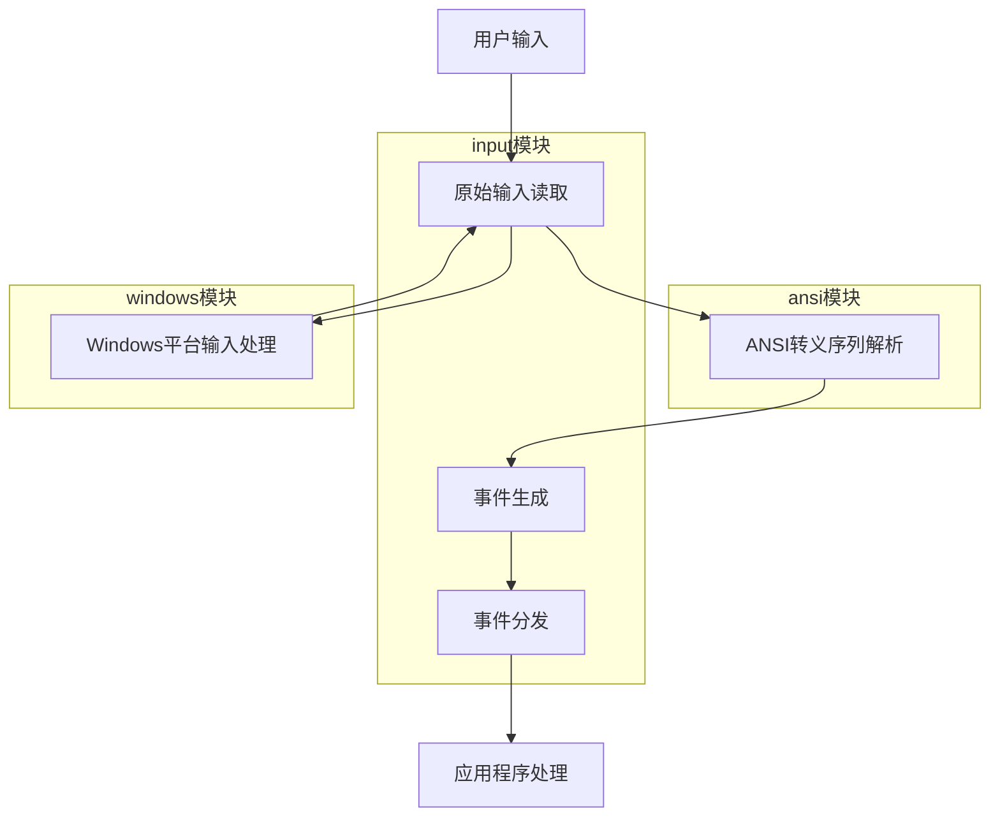
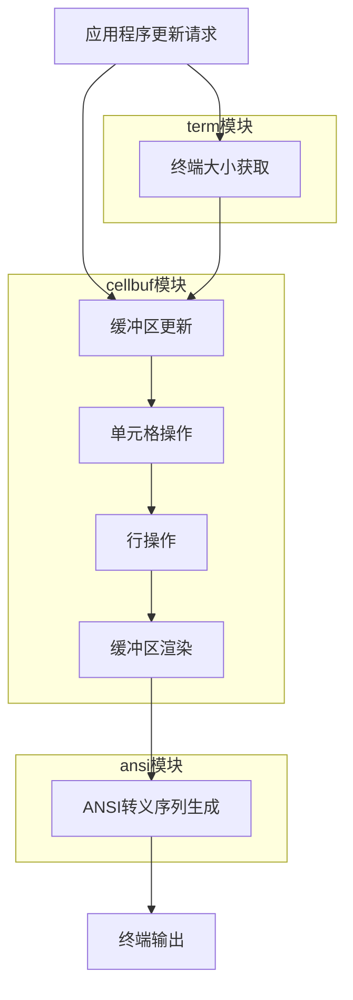
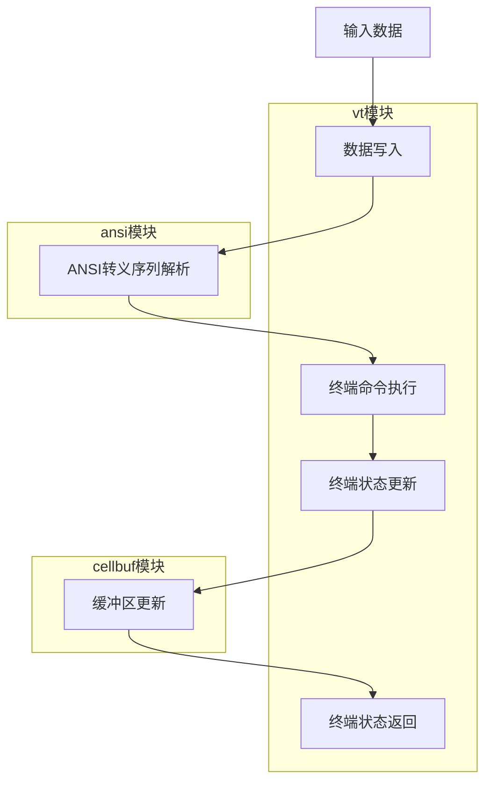
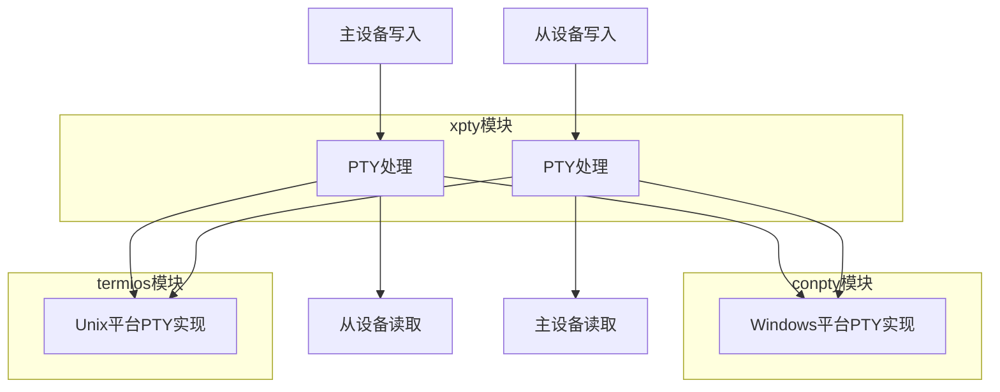
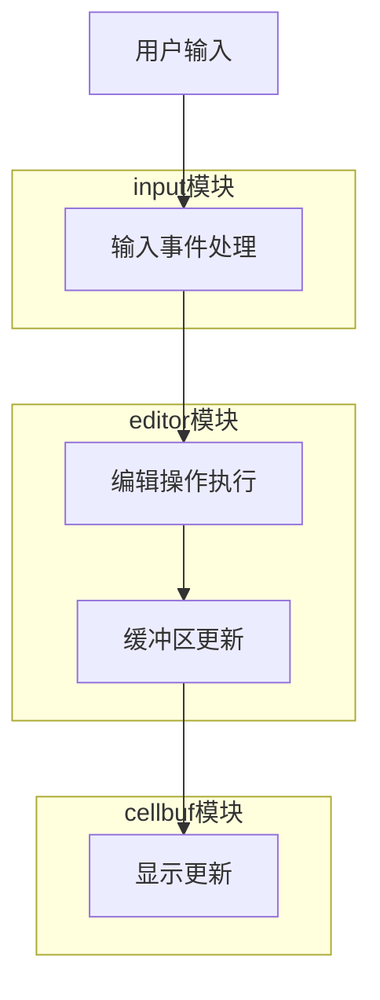
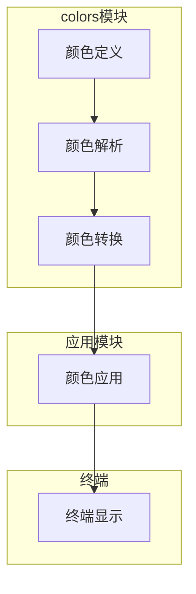
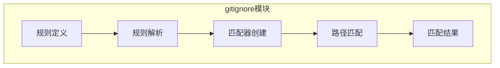
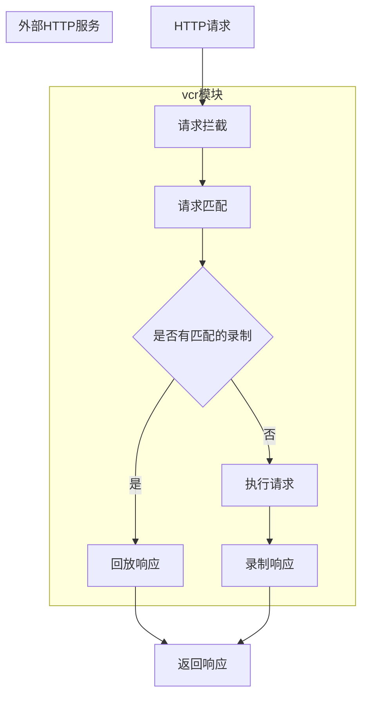

# 数据流程文档

## 1. 数据流程概述

`charm-experimental-packages-cn` 项目是一个终端相关的工具库集合，包含多个模块，每个模块负责不同的功能。本文档详细描述了项目中关键业务流程的数据流转过程，包括终端输入处理、终端显示处理、虚拟终端模拟、PTY 操作和编辑器操作等核心流程。

通过了解这些数据流程，开发者可以更好地理解项目的工作原理，从而更有效地使用和扩展项目功能。

## 2. 终端输入处理流程

### 2.1 流程说明

终端输入处理流程是从用户输入到事件处理的完整过程，涉及 input 模块、ansi 模块和 windows 模块等多个模块的协作。

### 2.2 数据流转图



### 2.3 数据传递过程

1. **用户输入**：用户通过键盘或鼠标在终端中输入数据
2. **原始输入读取**：input 模块从标准输入读取原始字节数据
3. **ANSI 转义序列解析**：input 模块将原始输入传递给 ansi 模块进行解析，识别出其中的 ANSI 转义序列
4. **事件生成**：input 模块根据解析结果生成相应的输入事件，如按键事件、鼠标事件等
5. **事件分发**：input 模块将生成的事件通过通道分发给应用程序
6. **应用程序处理**：应用程序接收并处理输入事件，执行相应的操作

### 2.4 关键代码示例

```go
// 创建输入处理器
in := input.New()

// 开始处理输入
in.Start()

// 接收输入事件
for {
    select {
    case event := <-in.Events():
        // 处理输入事件
        switch event.Type {
        case input.Key:
            fmt.Printf("Key pressed: %s\n", event.Key.Name)
        case input.Mouse:
            fmt.Printf("Mouse event: %v at (%d,%d)\n", event.Mouse.Type, event.Mouse.X, event.Mouse.Y)
        case input.Resize:
            fmt.Println("Terminal resized")
        }
    }
}

// 停止处理输入
in.Stop()
```

## 3. 终端显示处理流程

### 3.1 流程说明

终端显示处理流程是从缓冲区更新到终端输出的完整过程，涉及 cellbuf 模块、ansi 模块和 term 模块等多个模块的协作。

### 3.2 数据流转图



### 3.3 数据传递过程

1. **应用程序更新请求**：应用程序请求更新终端显示
2. **终端大小获取**：应用程序通过 term 模块获取终端大小，以确定缓冲区大小
3. **缓冲区更新**：应用程序通过 cellbuf 模块更新缓冲区内容
4. **单元格操作**：cellbuf 模块处理单元格级别的操作，如设置、获取、清除单元格
5. **行操作**：cellbuf 模块处理行级别的操作，如插入、删除、移动行
6. **缓冲区渲染**：cellbuf 模块将缓冲区内容渲染为可显示的格式
7. **ANSI 转义序列生成**：应用程序通过 ansi 模块生成相应的 ANSI 转义序列
8. **终端输出**：应用程序将生成的 ANSI 转义序列输出到终端，更新显示

### 3.4 关键代码示例

```go
// 获取终端大小
width, height, err := term.Size()
if err != nil {
    log.Fatal(err)
}

// 创建缓冲区
buf := cellbuf.NewBuffer(width, height)

// 创建单元格
cell := cellbuf.NewCell('H')

// 设置单元格
buf.SetCell(0, 0, cell)

// 清除缓冲区
buf.Clear()

// 插入行
buf.InsertLine(10, 2, nil)

// 删除行
buf.DeleteLine(10, 1, nil)

// 生成 ANSI 转义序列并输出到终端
fmt.Print("\x1b[31mHello\x1b[0m")
```

## 4. 虚拟终端模拟流程

### 4.1 流程说明

虚拟终端模拟流程是从输入数据到终端状态更新的完整过程，涉及 vt 模块、ansi 模块和 cellbuf 模块等多个模块的协作。

### 4.2 数据流转图



### 4.3 数据传递过程

1. **输入数据**：外部程序向虚拟终端写入数据
2. **数据写入**：vt 模块接收并处理写入的数据
3. **ANSI 转义序列解析**：vt 模块将数据传递给 ansi 模块进行解析，识别出其中的 ANSI 转义序列和命令
4. **终端命令执行**：vt 模块根据解析结果执行相应的终端命令，如光标移动、文本插入、清除屏幕等
5. **终端状态更新**：vt 模块更新终端的内部状态，如光标位置、模式设置等
6. **缓冲区更新**：vt 模块更新 cellbuf 模块中的缓冲区内容，反映终端状态的变化
7. **终端状态返回**：vt 模块返回更新后的终端状态，供外部程序查询

### 4.4 关键代码示例

```go
// 创建虚拟终端
width, height := 80, 24
terminal := vt.New(width, height)

// 向终端写入数据
data := []byte("Hello, World!\r\n")
_, err := terminal.Write(data)
if err != nil {
    log.Fatal(err)
}

// 获取终端缓冲区
buffer := terminal.Buffer()

// 读取终端缓冲区内容
fmt.Println(buffer.String())

// 调整终端大小
terminal.Resize(100, 30)
```

## 5. PTY 操作流程

### 5.1 流程说明

PTY (Pseudo-Terminal) 操作流程是从主设备到从设备的数据传输过程，涉及 xpty 模块、conpty 模块和 termios 模块等多个模块的协作。

### 5.2 数据流转图



### 5.3 数据传递过程

1. **主设备写入**：主设备（如终端模拟器）向 PTY 写入数据
2. **PTY 处理**：xpty 模块接收并处理写入的数据，根据平台类型选择相应的实现
3. **从设备读取**：从设备（如 shell）从 PTY 读取数据，执行相应的操作
4. **从设备写入**：从设备向 PTY 写入数据，如命令输出
5. **PTY 处理**：xpty 模块接收并处理写入的数据，根据平台类型选择相应的实现
6. **主设备读取**：主设备从 PTY 读取数据，显示到终端

### 5.4 关键代码示例

```go
// 创建 PTY
pty, err := xpty.New()
if err != nil {
    log.Fatal(err)
}
defer pty.Close()

// 获取主设备和从设备
master := pty.Master()
slave := pty.Slave()

// 向从设备写入数据
data := []byte("echo Hello, PTY!\r\n")
_, err = slave.Write(data)
if err != nil {
    log.Fatal(err)
}

// 从主设备读取数据
buf := make([]byte, 1024)
n, err := master.Read(buf)
if err != nil {
    log.Fatal(err)
}

fmt.Print(string(buf[:n]))
```

## 6. 编辑器操作流程

### 6.1 流程说明

编辑器操作流程是从用户输入到文本编辑的完整过程，涉及 editor 模块、input 模块和 cellbuf 模块等多个模块的协作。

### 6.2 数据流转图



### 6.3 数据传递过程

1. **用户输入**：用户通过键盘在编辑器中输入数据或执行编辑操作
2. **输入事件处理**：input 模块处理用户输入，生成相应的输入事件
3. **编辑操作执行**：editor 模块接收输入事件，执行相应的编辑操作，如插入字符、删除字符、移动光标等
4. **缓冲区更新**：editor 模块更新内部缓冲区内容，反映编辑操作的结果
5. **显示更新**：editor 模块通过 cellbuf 模块更新显示内容，将编辑结果显示给用户

### 6.4 关键代码示例

```go
// 创建编辑器
editor := editor.New()

// 设置编辑器内容
editor.SetContent("Hello, Editor!")

// 模拟用户输入
editor.Insert('W')
editor.CursorLeft()
editor.Delete()

// 获取编辑器内容
content := editor.Content()
fmt.Println(content)

// 光标操作
editor.CursorUp()
editor.CursorDown()
editor.CursorLeft()
editor.CursorRight()
```

## 7. 颜色处理流程

### 7.1 流程说明

颜色处理流程是从颜色定义到终端显示的完整过程，涉及 colors 模块和其他使用颜色的模块。

### 7.2 数据流转图



### 7.3 数据传递过程

1. **颜色定义**：用户通过字符串、RGB 值等方式定义颜色
2. **颜色解析**：colors 模块解析颜色定义，转换为内部表示
3. **颜色转换**：colors 模块根据需要将颜色转换为不同的表示形式，如 RGB、ANSI 转义序列等
4. **颜色应用**：应用模块将颜色应用到文本或 UI 元素上
5. **终端显示**：终端根据颜色信息显示相应的颜色

### 7.4 关键代码示例

```go
// 解析颜色字符串
color, err := colors.Parse("#FF0000")
if err != nil {
    log.Fatal(err)
}

// 创建 RGB 颜色
color := colors.RGB(255, 0, 0)

// 创建 RGBA 颜色
color := colors.RGBA(255, 0, 0, 128)

// 应用颜色到文本
fmt.Printf("\x1b[31mRed text\x1b[0m\n")
```

## 8. Git 忽略规则处理流程

### 8.1 流程说明

Git 忽略规则处理流程是从规则解析到路径匹配的完整过程，涉及 gitignore 模块。

### 8.2 数据流转图



### 8.3 数据传递过程

1. **规则定义**：用户在 .gitignore 文件中定义忽略规则
2. **规则解析**：gitignore 模块解析 .gitignore 文件，提取忽略规则
3. **匹配器创建**：gitignore 模块根据解析出的规则创建匹配器
4. **路径匹配**：gitignore 模块使用匹配器匹配文件路径
5. **匹配结果**：gitignore 模块返回匹配结果，指示路径是否应该被忽略

### 8.4 关键代码示例

```go
// 解析 .gitignore 文件
patterns, err := gitignore.ParseFile(".gitignore")
if err != nil {
    log.Fatal(err)
}

// 创建匹配器
matcher := gitignore.NewMatcher(patterns)

// 匹配路径
path := "build/output.exe"
isIgnored := matcher.Match(path, false)
fmt.Printf("Path %s is %s\n", path, map[bool]string{true: "ignored", false: "not ignored"}[isIgnored])

// 匹配目录
path = "node_modules"
isIgnored = matcher.Match(path, true)
fmt.Printf("Path %s is %s\n", path, map[bool]string{true: "ignored", false: "not ignored"}[isIgnored])
```

## 9. HTTP 请求录制/回放流程

### 9.1 流程说明

HTTP 请求录制/回放流程是从请求执行到响应录制和回放的完整过程，涉及 vcr 模块。

### 9.2 数据流转图



### 9.3 数据传递过程

1. **HTTP 请求**：应用程序发起 HTTP 请求
2. **请求拦截**：vcr 模块拦截 HTTP 请求
3. **请求匹配**：vcr 模块尝试在录制的交互中匹配请求
4. **是否有匹配的录制**：vcr 模块检查是否有匹配的录制响应
5. **回放响应**：如果有匹配的录制，vcr 模块回放录制的响应
6. **执行请求**：如果没有匹配的录制，vcr 模块执行实际的 HTTP 请求
7. **录制响应**：vcr 模块录制 HTTP 响应
8. **返回响应**：vcr 模块将响应返回给应用程序

### 9.4 关键代码示例

```go
// 创建录制器
recorder := vcr.NewRecorder()

// 开始录制
err := recorder.Start("cassette.yaml", vcr.RecordMode)
if err != nil {
    log.Fatal(err)
}
defer recorder.Stop()

// 创建 HTTP 客户端
client := &http.Client{
    Transport: recorder,
}

// 发起 HTTP 请求
resp, err := client.Get("https://example.com")
if err != nil {
    log.Fatal(err)
}
defer resp.Body.Close()

// 读取响应
body, err := io.ReadAll(resp.Body)
if err != nil {
    log.Fatal(err)
}

fmt.Println(string(body))
```

## 10. 数据流程优化建议

### 10.1 终端输入处理优化

1. **缓冲输入**：对于高频输入，考虑使用缓冲区减少系统调用次数
2. **事件合并**：对于连续的相同类型事件，考虑合并处理以提高效率
3. **异步处理**：将输入处理与业务逻辑分离，使用异步方式处理输入事件

### 10.2 终端显示处理优化

1. **差异更新**：只更新发生变化的部分，减少不必要的重绘
2. **批量操作**：将多个小的更新操作合并为一个批量操作，减少系统调用次数
3. **缓存优化**：缓存常用的 ANSI 转义序列，减少重复生成

### 10.3 虚拟终端模拟优化

1. **状态缓存**：缓存终端状态，减少重复计算
2. **命令优化**：对于常用命令，提供优化的实现
3. **并行处理**：对于复杂的终端操作，考虑使用并行处理提高性能

### 10.4 PTY 操作优化

1. **缓冲区大小**：根据实际需求调整缓冲区大小，平衡内存使用和性能
2. **读写优化**：使用非阻塞 I/O 或异步 I/O 提高读写性能
3. **错误处理**：优化错误处理逻辑，减少错误处理的开销

### 10.5 编辑器操作优化

1. **文本存储**：使用高效的文本存储结构，如 rope 数据结构
2. **操作撤销**：实现高效的操作撤销/重做机制
3. **语法高亮**：使用增量语法高亮，只处理变化的部分

## 11. 总结

`charm-experimental-packages-cn` 项目的核心数据流程涵盖了终端输入处理、终端显示处理、虚拟终端模拟、PTY 操作和编辑器操作等多个方面。这些流程相互协作，构成了完整的终端工具生态系统。

通过了解这些数据流程，开发者可以：

1. **更好地理解项目**：了解数据如何在各个模块间流动，从而更深入地理解项目的工作原理
2. **更有效地使用项目**：根据数据流程的特点，选择合适的模块和 API 来实现所需功能
3. **更有针对性地扩展项目**：根据数据流程的瓶颈和优化空间，有针对性地扩展和优化项目功能
4. **更快速地排查问题**：当遇到问题时，可以根据数据流程追踪问题的根源，更快速地排查和解决问题

随着项目的不断发展和完善，这些数据流程也会不断优化和演进，以适应新的需求和技术趋势。开发者可以通过持续关注项目的更新和文档的变化，及时了解这些变化，从而更好地利用项目的功能。