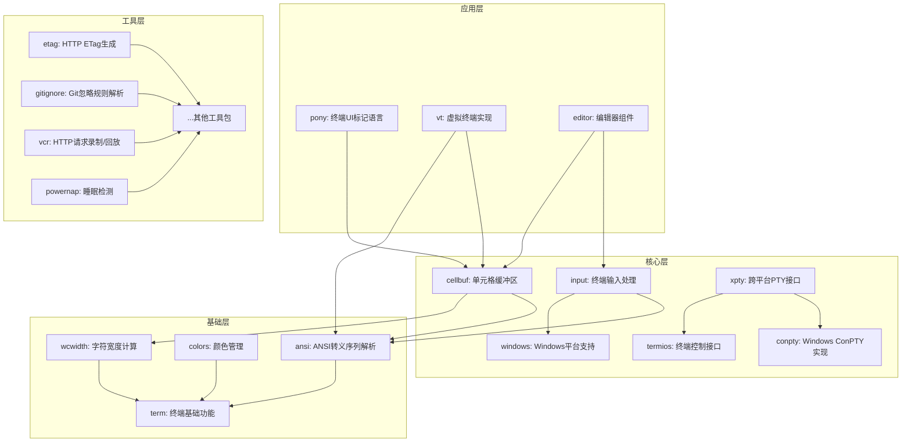

# 项目架构概述

## 1. 项目简介

`charm-experimental-packages-cn` 是一个基于 Charmbracelet/x 分支二次开发的实验性包集合，提供了一系列终端相关的工具和库。该项目旨在为 Go 语言开发者提供高质量、跨平台的终端处理解决方案，包括 ANSI 转义序列解析、终端输入处理、颜色管理、伪终端实现等功能。

## 2. 系统整体架构设计

### 2.1 架构风格

项目采用模块化、分层架构设计，每个功能模块都是独立的 Go 包，具有明确的职责边界和依赖关系。整体架构遵循以下原则：

- **高内聚低耦合**：每个包专注于单一功能领域，通过清晰的接口与其他包交互
- **模块化设计**：功能划分为多个独立模块，便于维护和扩展
- **跨平台兼容**：提供统一的接口，在不同平台上实现相同的功能
- **可测试性**：设计考虑了测试需求，支持单元测试和集成测试

### 2.2 核心组件关系

项目包含多个核心组件，它们之间的关系如下：

### 2.3 技术架构图

项目的技术架构可以分为以下几个层次：

1. **基础层**：提供底层的终端相关功能，如 ANSI 转义序列解析、终端基础功能、颜色管理等
2. **核心层**：构建在基础层之上，提供更高级的功能，如单元格缓冲区、终端输入处理、跨平台 PTY 接口等
3. **应用层**：使用核心层的功能，提供面向应用的组件，如终端 UI 标记语言、虚拟终端实现、编辑器组件等
4. **工具层**：提供各种实用工具，如 HTTP ETag 生成、Git 忽略规则解析、HTTP 请求录制/回放等

## 3. 核心功能模块

### 3.1 基础功能模块

- **ansi**：ANSI 转义序列解析器和定义，提供对终端控制序列的解析和处理
- **term**：终端基础功能，提供终端相关的基本操作和功能
- **colors**：颜色管理，提供终端颜色的处理和转换
- **wcwidth**：字符宽度计算，提供对不同字符宽度的计算

### 3.2 核心功能模块

- **cellbuf**：基于单元格的终端显示解析器，提供终端屏幕的单元格级表示和操作
- **input**：终端事件输入处理器和驱动，提供对终端输入事件的处理
- **xpty**：跨平台 PTY 接口，提供在不同平台上的伪终端实现
- **conpty**：Windows 控制台伪终端库，提供 Windows 平台上的 PTY 支持

### 3.3 应用功能模块

- **pony**：声明式终端 UI 标记语言，提供一种简洁的方式来描述终端 UI
- **vt**：虚拟终端实现，提供完整的终端模拟功能
- **editor**：编辑器组件，提供基本的文本编辑功能

### 3.4 工具功能模块

- **etag**：HTTP ETag 生成工具，提供生成和验证 HTTP ETag 的功能
- **gitignore**：Git 忽略规则解析，提供对 .gitignore 文件规则的解析和匹配
- **vcr**：HTTP 请求录制/回放，提供对 HTTP 请求的录制和回放功能
- **powernap**：睡眠检测，提供系统睡眠状态的检测功能

## 4. 模块间依赖关系

项目模块之间存在一定的依赖关系，主要表现为：

- 基础层模块被其他所有模块依赖
- 核心层模块依赖基础层模块，并被应用层模块依赖
- 应用层模块依赖核心层和基础层模块
- 工具层模块通常是独立的，不依赖其他模块或只依赖基础层模块

具体依赖关系如下：

| 模块 | 主要依赖 | 被依赖模块 |
|------|---------|-----------|
| ansi | 无 | cellbuf, input, vt |
| cellbuf | ansi, term | pony, vt |
| input | ansi, windows | editor |
| xpty | conpty, termios | 无 |
| pony | cellbuf | 无 |
| vt | ansi, cellbuf | 无 |
| etag | 无 | 无 |
| gitignore | 无 | 无 |
| vcr | 无 | 无 |

## 5. 系统特点

1. **模块化设计**：每个功能都被封装在独立的包中，便于使用和维护
2. **跨平台兼容**：提供统一的接口，在不同平台上实现相同的功能
3. **高性能**：针对终端操作进行了优化，提供高效的实现
4. **易于扩展**：模块化的设计使得添加新功能变得简单
5. **丰富的功能**：提供了从基础到高级的各种终端相关功能
6. **良好的文档**：每个模块都有详细的文档和示例

## 6. 技术创新点

1. **跨平台 PTY 实现**：通过 xpty 包提供了统一的跨平台 PTY 接口，简化了跨平台终端应用的开发
2. **声明式终端 UI**：pony 包提供了一种声明式的终端 UI 标记语言，使得终端 UI 的开发更加简单直观
3. **高效的单元格缓冲区**：cellbuf 包提供了高效的单元格级终端显示表示，支持复杂的终端操作
4. **统一的颜色管理**：colors 包提供了统一的颜色管理方案，支持不同终端的颜色表示

## 7. 架构演进方向

1. **功能完善**：继续完善现有模块的功能，添加更多实用的终端相关功能
2. **性能优化**：对核心模块进行性能优化，提高终端操作的效率
3. **跨平台增强**：进一步增强跨平台支持，确保在所有主流平台上都能正常工作
4. **生态系统建设**：构建围绕这些核心包的生态系统，提供更多高级组件和工具
5. **文档和示例**：提供更多的文档和示例，帮助开发者更好地使用这些包

## 8. 总结

`charm-experimental-packages-cn` 项目采用模块化、分层的架构设计，提供了一系列高质量、跨平台的终端相关工具和库。通过清晰的模块划分和依赖关系，使得项目易于维护和扩展。该项目为 Go 语言开发者提供了强大的终端处理能力，是开发终端应用的理想选择。