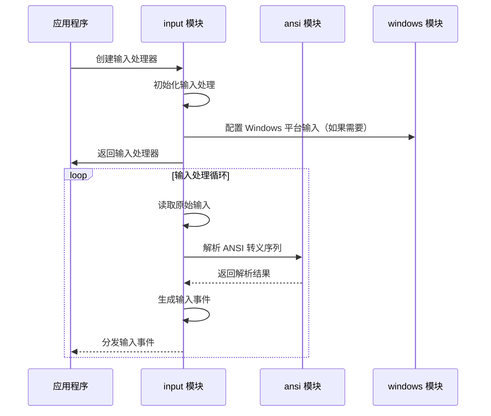
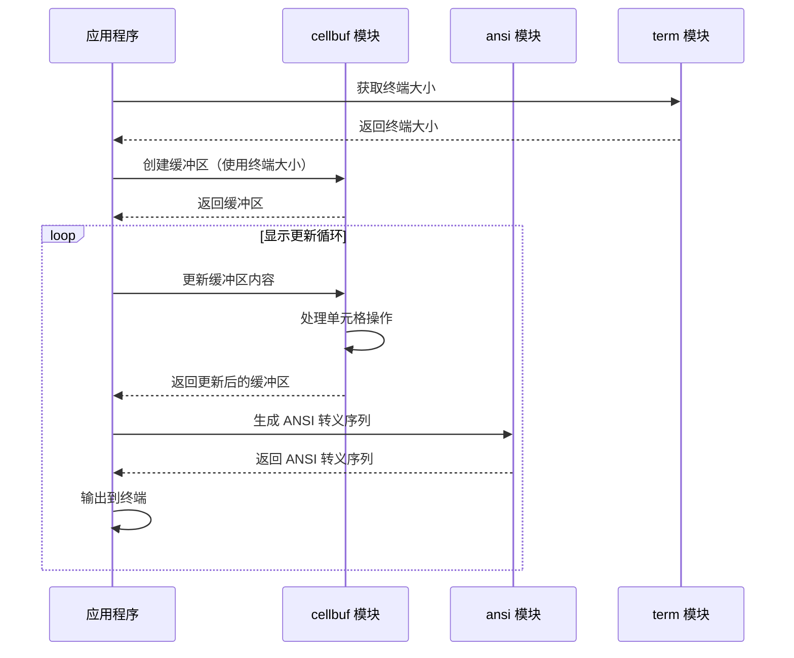

# 模块划分

## 1. 模块划分概述

`charm-experimental-packages-cn` 项目采用模块化设计，将终端相关功能划分为多个独立的 Go 包。每个模块专注于特定的功能领域，通过清晰的接口与其他模块交互。这种设计使得项目易于维护、扩展和使用。

项目模块按照功能层次和依赖关系可分为以下几类：

1. **基础层模块**：提供底层的终端相关功能，如 ANSI 转义序列解析、终端基础功能、颜色管理等
2. **核心层模块**：构建在基础层之上，提供更高级的功能，如单元格缓冲区、终端输入处理、跨平台 PTY 接口等
3. **应用层模块**：使用核心层的功能，提供面向应用的组件，如终端 UI 标记语言、虚拟终端实现、编辑器组件等
4. **工具层模块**：提供各种实用工具，如 HTTP ETag 生成、Git 忽略规则解析、HTTP 请求录制/回放等

## 2. 基础层模块

### 2.1 ansi

| 模块信息 | 详细说明 |
|----------|----------|
| **路径** | `./ansi` |
| **功能描述** | ANSI 转义序列解析器和定义，提供对终端控制序列的解析和处理 |
| **核心职责** |
| - 定义 ANSI 转义序列常量 |
| - 解析 ANSI 转义序列 |
| - 处理终端控制序列 |
| - 提供 ANSI 相关的工具函数 |
| **关键接口** |
| - `Parse()`：解析 ANSI 转义序列 |
| - `Sequence`：表示 ANSI 转义序列的结构 |
| - `Command`：表示 ANSI 命令的结构 |
| **依赖关系** | 无外部依赖，是其他模块的基础 |
| **被依赖模块** | cellbuf, input, vt |

### 2.2 term

| 模块信息 | 详细说明 |
|----------|----------|
| **路径** | `./term` |
| **功能描述** | 终端基础功能，提供终端相关的基本操作和功能 |
| **核心职责** |
| - 终端大小获取和设置 |
| - 终端模式管理 |
| - 终端输入/输出处理 |
| - 跨平台终端功能封装 |
| **关键接口** |
| - `Size()`：获取终端大小 |
| - `SetRaw()`：设置终端为原始模式 |
| - `Restore()`：恢复终端模式 |
| **依赖关系** | 无外部依赖 |
| **被依赖模块** | cellbuf |

### 2.3 colors

| 模块信息 | 详细说明 |
|----------|----------|
| **路径** | `./colors` |
| **功能描述** | 颜色管理，提供终端颜色的处理和转换 |
| **核心职责** |
| - 颜色定义和转换 |
| - 颜色配置文件管理 |
| - 终端颜色支持检测 |
| - 颜色主题管理 |
| **关键接口** |
| - `Color`：表示颜色的结构 |
| - `Parse()`：解析颜色字符串 |
| - `Convert()`：转换颜色格式 |
| **依赖关系** | 无外部依赖 |
| **被依赖模块** | 无直接依赖，可被其他模块按需使用 |

### 2.4 wcwidth

| 模块信息 | 详细说明 |
|----------|----------|
| **路径** | `./wcwidth` |
| **功能描述** | 字符宽度计算，提供对不同字符宽度的计算 |
| **核心职责** |
| - 计算 Unicode 字符的显示宽度 |
| - 处理双宽字符和组合字符 |
| - 提供字符宽度相关的工具函数 |
| **关键接口** |
| - `RuneWidth()`：计算单个字符的宽度 |
| - `StringWidth()`：计算字符串的宽度 |
| **依赖关系** | 无外部依赖 |
| **被依赖模块** | cellbuf |

## 3. 核心层模块

### 3.1 cellbuf

| 模块信息 | 详细说明 |
|----------|----------|
| **路径** | `./cellbuf` |
| **功能描述** | 基于单元格的终端显示解析器，提供终端屏幕的单元格级表示和操作 |
| **核心职责** |
| - 管理终端屏幕的单元格缓冲区 |
| - 处理单元格级别的操作（设置、获取、清除等） |
| - 支持行操作（插入、删除、移动等） |
| - 处理宽字符和组合字符 |
| **关键接口** |
| - `Buffer`：表示终端屏幕的缓冲区结构 |
| - `Cell`：表示终端单元格的结构 |
| - `Line`：表示终端行的结构 |
| - `NewBuffer()`：创建新的缓冲区 |
| - `SetCell()`：设置单元格内容 |
| - `Cell()`：获取单元格内容 |
| **依赖关系** | ansi, term, github.com/mattn/go-runewidth, github.com/rivo/uniseg |
| **被依赖模块** | pony, vt |

### 3.2 input

| 模块信息 | 详细说明 |
|----------|----------|
| **路径** | `./input` |
| **功能描述** | 终端事件输入处理器和驱动，提供对终端输入事件的处理 |
| **核心职责** |
| - 处理终端输入事件 |
| - 支持键盘和鼠标输入 |
| - 提供输入事件的解析和分发 |
| - 支持跨平台输入处理 |
| **关键接口** |
| - `Input`：输入处理器接口 |
| - `Event`：表示输入事件的结构 |
| - `Start()`：开始处理输入 |
| - `Stop()`：停止处理输入 |
| **依赖关系** | ansi, windows, github.com/muesli/cancelreader, github.com/xo/terminfo, golang.org/x/sys |
| **被依赖模块** | editor |

### 3.3 xpty

| 模块信息 | 详细说明 |
|----------|----------|
| **路径** | `./xpty` |
| **功能描述** | 跨平台 PTY 接口，提供在不同平台上的伪终端实现 |
| **核心职责** |
| - 提供跨平台的 PTY 接口 |
| - 封装平台特定的 PTY 实现 |
| - 支持 PTY 的创建和管理 |
| - 提供 PTY 的读写操作 |
| **关键接口** |
| - `PTY`：表示伪终端的接口 |
| - `New()`：创建新的 PTY |
| - `Master()`：获取主设备文件描述符 |
| - `Slave()`：获取从设备文件描述符 |
| **依赖关系** | conpty, termios |
| **被依赖模块** | 无直接依赖，可被其他模块按需使用 |

### 3.4 conpty

| 模块信息 | 详细说明 |
|----------|----------|
| **路径** | `./conpty` |
| **功能描述** | Windows 控制台伪终端库，提供 Windows 平台上的 PTY 支持 |
| **核心职责** |
| - 封装 Windows ConPTY API |
| - 提供 Windows 平台上的 PTY 实现 |
| - 支持 ConPTY 的创建和管理 |
| - 提供 ConPTY 的读写操作 |
| **关键接口** |
| - `ConPTY`：表示 Windows ConPTY 的结构 |
| - `New()`：创建新的 ConPTY |
| - `Read()`：从 ConPTY 读取数据 |
| - `Write()`：向 ConPTY 写入数据 |
| **依赖关系** | golang.org/x/sys |
| **被依赖模块** | xpty |

## 4. 应用层模块

### 4.1 pony

| 模块信息 | 详细说明 |
|----------|----------|
| **路径** | `./pony` |
| **功能描述** | 声明式终端 UI 标记语言，提供一种简洁的方式来描述终端 UI |
| **核心职责** |
| - 解析 pony 标记语言 |
| - 生成终端 UI 元素 |
| - 支持布局和样式定义 |
| - 提供组件化的 UI 构建 |
| **关键接口** |
| - `Parse()`：解析 pony 标记 |
| - `Render()`：渲染 pony 标记为终端输出 |
| - `Component`：表示 UI 组件的接口 |
| **依赖关系** | cellbuf |
| **被依赖模块** | 无直接依赖，可被其他模块按需使用 |

### 4.2 vt

| 模块信息 | 详细说明 |
|----------|----------|
| **路径** | `./vt` |
| **功能描述** | 虚拟终端实现，提供完整的终端模拟功能 |
| **核心职责** |
| - 模拟终端行为和状态 |
| - 处理终端控制序列 |
| - 维护终端屏幕缓冲区 |
| - 支持终端模式和功能 |
| **关键接口** |
| - `Terminal`：表示虚拟终端的结构 |
| - `New()`：创建新的虚拟终端 |
| - `Write()`：向终端写入数据 |
| - `Read()`：从终端读取数据 |
| **依赖关系** | ansi, cellbuf |
| **被依赖模块** | 无直接依赖，可被其他模块按需使用 |

### 4.3 editor

| 模块信息 | 详细说明 |
|----------|----------|
| **路径** | `./editor` |
| **功能描述** | 编辑器组件，提供基本的文本编辑功能 |
| **核心职责** |
| - 提供文本编辑功能 |
| - 支持光标移动和选择 |
| - 处理键盘输入和快捷键 |
| - 支持文本的插入、删除和修改 |
| **关键接口** |
| - `Editor`：表示编辑器的结构 |
| - `New()`：创建新的编辑器 |
| - `Insert()`：插入文本 |
| - `Delete()`：删除文本 |
| **依赖关系** | input, cellbuf |
| **被依赖模块** | 无直接依赖，可被其他模块按需使用 |

## 5. 工具层模块

### 5.1 etag

| 模块信息 | 详细说明 |
|----------|----------|
| **路径** | `./etag` |
| **功能描述** | HTTP ETag 生成工具，提供生成和验证 HTTP ETag 的功能 |
| **核心职责** |
| - 生成 HTTP ETag |
| - 验证 HTTP ETag |
| - 支持强 ETag 和弱 ETag |
| - 提供 ETag 相关的工具函数 |
| **关键接口** |
| - `Generate()`：生成 ETag |
| - `Validate()`：验证 ETag |
| **依赖关系** | 无外部依赖 |
| **被依赖模块** | 无直接依赖，可被其他模块按需使用 |

### 5.2 gitignore

| 模块信息 | 详细说明 |
|----------|----------|
| **路径** | `./gitignore` |
| **功能描述** | Git 忽略规则解析，提供对 .gitignore 文件规则的解析和匹配 |
| **核心职责** |
| - 解析 .gitignore 文件 |
| - 匹配 Git 忽略规则 |
| - 支持复杂的忽略模式 |
| - 提供忽略规则相关的工具函数 |
| **关键接口** |
| - `Parse()`：解析 .gitignore 文件 |
| - `Match()`：匹配忽略规则 |
| **依赖关系** | 无外部依赖 |
| **被依赖模块** | 无直接依赖，可被其他模块按需使用 |

### 5.3 vcr

| 模块信息 | 详细说明 |
|----------|----------|
| **路径** | `./vcr` |
| **功能描述** | HTTP 请求录制/回放，提供对 HTTP 请求的录制和回放功能 |
| **核心职责** |
| - 录制 HTTP 请求和响应 |
| - 回放录制的 HTTP 请求 |
| - 支持请求匹配和响应定制 |
| - 提供 VCR 相关的工具函数 |
| **关键接口** |
| - `Recorder`：表示请求录制器的结构 |
| - `Start()`：开始录制 |
| - `Stop()`：停止录制 |
| - `Playback()`：回放录制的请求 |
| **依赖关系** | 无外部依赖 |
| **被依赖模块** | 无直接依赖，可被其他模块按需使用 |

### 5.4 powernap

| 模块信息 | 详细说明 |
|----------|----------|
| **路径** | `./powernap` |
| **功能描述** | 睡眠检测，提供系统睡眠状态的检测功能 |
| **核心职责** |
| - 检测系统睡眠状态 |
| - 监控系统唤醒事件 |
| - 提供睡眠状态相关的工具函数 |
| **关键接口** |
| - `Monitor()`：监控系统睡眠状态 |
| - `OnWake()`：注册唤醒事件回调 |
| **依赖关系** | 无外部依赖 |
| **被依赖模块** | 无直接依赖，可被其他模块按需使用 |

## 6. 模块间交互关系

### 6.1 依赖层次

项目模块之间形成了清晰的依赖层次：

1. **基础层**：位于最底层，不依赖其他模块，为其他模块提供基础功能
2. **核心层**：依赖基础层模块，为应用层模块提供核心功能
3. **应用层**：依赖核心层和基础层模块，提供面向应用的功能
4. **工具层**：通常独立，不依赖其他模块或只依赖基础层模块

### 6.2 交互方式

模块间主要通过以下方式交互：

1. **直接导入**：一个模块直接导入另一个模块的包，使用其导出的函数和类型
2. **接口实现**：一个模块实现另一个模块定义的接口
3. **回调函数**：一个模块通过回调函数与另一个模块交互
4. **事件机制**：一个模块通过事件机制通知其他模块发生的事件

### 6.3 典型交互流程

#### 6.3.1 终端输入处理流程



#### 6.3.2 终端显示处理流程



## 7. 模块使用指南

### 7.1 基础层模块使用

#### 7.1.1 ansi 模块

```go
import "github.com/purpose168/charm-experimental-packages-cn/ansi"

// 解析 ANSI 转义序列
sequences := ansi.Parse("\x1b[31mHello\x1b[0m")
for _, seq := range sequences {
    // 处理转义序列
}
```

#### 7.1.2 term 模块

```go
import "github.com/purpose168/charm-experimental-packages-cn/term"

// 获取终端大小
width, height, err := term.Size()
if err != nil {
    // 处理错误
}

// 设置终端为原始模式
oldState, err := term.SetRaw()
if err != nil {
    // 处理错误
}

// 恢复终端模式
defer term.Restore(oldState)
```

### 7.2 核心层模块使用

#### 7.2.1 cellbuf 模块

```go
import "github.com/purpose168/charm-experimental-packages-cn/cellbuf"

// 创建缓冲区
buf := cellbuf.NewBuffer(80, 24)

// 设置单元格
cell := cellbuf.NewCell('H')
buf.SetCell(0, 0, cell)

// 获取单元格
c := buf.Cell(0, 0)

// 清除缓冲区
buf.Clear()
```

#### 7.2.2 input 模块

```go
import "github.com/purpose168/charm-experimental-packages-cn/input"

// 创建输入处理器
in := input.New()

// 开始处理输入
in.Start()

// 接收输入事件
for {
    select {
    case event := <-in.Events():
        // 处理输入事件
    }
}

// 停止处理输入
in.Stop()
```

### 7.3 应用层模块使用

#### 7.3.1 pony 模块

```go
import "github.com/purpose168/charm-experimental-packages-cn/pony"

// 解析 pony 标记
nodes := pony.Parse(`
# Hello, Pony!

This is a **bold** text.
`)

// 渲染为终端输出
output := pony.Render(nodes)
fmt.Println(output)
```

### 7.4 工具层模块使用

#### 7.4.1 etag 模块

```go
import "github.com/purpose168/charm-experimental-packages-cn/etag"

// 生成 ETag
etagValue := etag.Generate("Hello, World!")

// 验证 ETag
valid := etag.Validate(etagValue, "Hello, World!")
```

## 8. 总结

`charm-experimental-packages-cn` 项目通过清晰的模块划分和职责定义，构建了一个完整的终端工具生态系统。每个模块都专注于特定的功能领域，通过清晰的接口与其他模块交互，形成了一个层次分明、结构清晰的系统。

这种模块化设计带来了以下好处：

1. **易于维护**：每个模块都有明确的职责，代码结构清晰，便于理解和维护
2. **易于扩展**：可以通过添加新模块或扩展现有模块来增加功能
3. **易于使用**：开发者可以根据需要只导入所需的模块，减少不必要的依赖
4. **提高代码质量**：模块化设计促进了代码的复用和标准化，提高了代码质量
5. **便于测试**：每个模块都可以独立测试，提高了测试的效率和覆盖率

通过合理的模块划分和交互设计，`charm-experimental-packages-cn` 项目为 Go 语言开发者提供了一套强大、灵活、易用的终端工具库，适用于各种终端应用和命令行工具的开发。